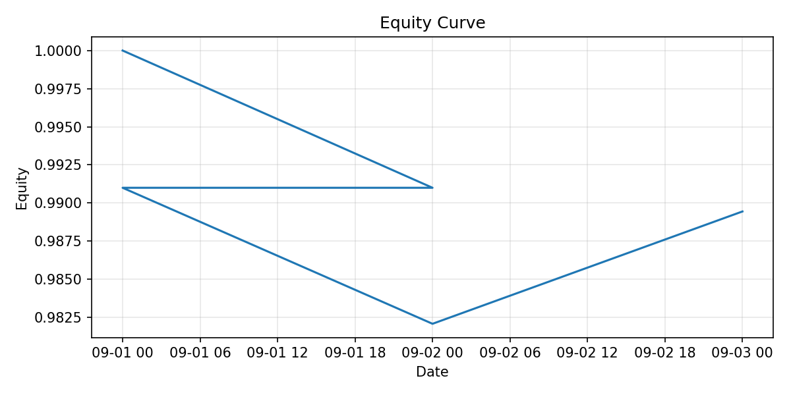

# ATS v0

Gates: [1:PASS][2:PASS][3:PASS]

## Performance (net of trading costs)




[Acceptance Matrix](docs/Acceptance_Matrix.md) — єдиний зведений стан прийомки шарів (Data + Universe + Factors + Alpha + Risk model + Portfolio + Execution + Monitoring).


### Run / Verify (Windows)
```powershell
powershell -NoProfile -ExecutionPolicy Bypass -File .\ops\bootstrap-runner.ps1
```

